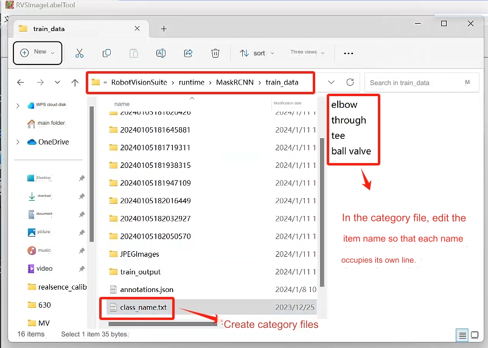

#3D disordered grabbing kit


## 1 Kit Hardware Introduction
### 1.1 MyCobot Pro630 Robotic Arm


### 1.2 Picture FS820-E1


## 2 Picture FS820-E1 Basic Instructions for Use
### 2.1 Camera software environment construction
&emsp;&emsp;Tuyang provides two developer modes, SDK and RVS mode. **RVS** is used here for development. You can use the visual operators in RVS to write nodes (Node) to quickly build the crawling function. Complete the RVS installation according to the [Installation Manual](http://res1.percipio.xyz/rvs/RVS_Install.pdf).

The official website provides two versions. The two versions only differ in the **AI operator**. The FULL version uses the GPU for AI training. Everything else is the same. Choose the FULL version for the kit.
The CPU version file name is: [RobotVisionSuite-WIN-XX-CPU.zip](http://res1.percipio.xyz/rvs/RobotVisionSuite-1.5-WinCPU.zip)
The FULL version file name is: [RobotVisionSuite-WIN-XX-GPU.zip](http://res1.percipio.xyz/rvs/RobotVisionSuite-1.5-WinGPU.zip)

**Notice**:
> - **After installation, you need to copy the machine code and send it to the official website email or ask the relevant personnel, get the activation code, create license.txt and put it in the license folder for activation**
> - **Select the installation path in (D:\\) to facilitate the operator path to read files**
>


### 2.2 Camera hardware connection
Find the camera power supply method on the official website. Here we use the [FS820-E1 camera](https://www.percipio.xyz/product-fmseries/product_fs820-e1/) model, which uses **DC 12V~24V** for power supply. Connection method [refer here](http://doc.percipio.xyz/cam/latest/getstarted/hardware-connection.html#net-connection-label). Use **method 1** here


### 2.3 Operator Overview
Details [refer here](http://res1.percipio.xyz/rvs/RVS_Node_Introduction.pdf)


### 2.4 Real-time collection of image camera data
In the upper left window **Resources**, find the TyCameraResource operator and add it to the ResourceGroup in the operator graph. Search the operator list for **TyCameraAccess** and **trigger** operators and add them to the operator graph. And adjust the operator parameters as needed. Then click **Run** and the property panel **Trigger->ture** to view the visual data. If no error is reported and it can be displayed normally, you can proceed to the next step.
> TyCameraResource operator
> - start and stop are used to open and close the thread of the resource operator respectively. **auto_start** is also used to start the resource operator. If
If checked, the resource thread will be automatically started only when the RVS software enters the running state for the first time after opening it.
> - reset: If you need to change the attribute parameters after opening the resource thread, you need to select this option to reset.

> TyCameraAccess operator
> - Open the cloud, rgb, and depth visualization properties, and set cloud_color to **-2**, which represents **real color**


## 3 Python environment construction
[Download address](https://www.python.org/downloads/windows/)


Select the version you want to install. It is recommended to install version 3.7 or above.


After double-clicking the installation package


Keep the default configuration and click Next

If you select a custom software installation location, click Install
(It is recommended that the installation file path be an English path, because some software installations cannot be opened when encountering Chinese)


After the installation is complete, you can complete the current page, then press the Windows key + r key on the keyboard and enter cmd

pymycobot installation
   ```python
   pip install pymycobot --upgrade --user
   ```


## 4 Hand-eye calibration
Prepare the chessboard, calculate the number of rows and columns of the chessboard, and the **checkerboard side length (mm)**
**Notice**:
Before starting each hand-eye calibration, you need to change the runtime\handeye_data in the RVS installation directory.
Clear all files in the folder
### 4.1 Data recording

Step 1: Click Load in the upper left corner, open unstacking_runtime/HandEyeCalibration/HandEyeCalibration.xml, and follow the instructions below


Step 2: Start the robotic arm
> Run the HandInEyeCalib.py file in the terminal
> 

Step 3: After starting the robot arm script, automatic calibration will begin.

> Before calibration, make sure that the camera can completely recognize the complete checkerboard, and during the calibration process, the checkerboard is fixed and cannot move. After the operation is completed, 20 sets of data will be obtained.


### 4.2 Calculate calibration results
Calculate hand-eye calibration results


It is ideal if the position error is within 0.005 (5 mm); if the error is large, please check whether the previous steps are performed correctly


## 5 Model training
**Notice**:
The model has been trained and can be used directly by customers without further training. Just read the case operation chapter directly. If customers want to train by themselves, they can first delete all the files in the runtime/MaskRCNN/train data folder in the installation directory and follow the instructions below.
### 5.1 Collect images
Open RVS to load the unstacking_runtime/MaskRCNN/ty_ai_savedata.xml file


**When collecting images, we should pay attention to the following points:**

+ background lighting
   + Single stable light source, suitable brightness and darkness without excessive reflection
   + Outdoor lighting conditions change too much, so it is not recommended

+ Consideration of complex working conditions
   + Try to make the sampling sample sufficiently representative of the actual running global sample and not just a special case of the global sample
 
+ image quality
   + The human eye needs to be able to clearly see the edge of the target, especially the target layer farthest from the camera. Otherwise, if you consider changing the camera, you can refer to the rgb image in unstacking_runtime/MaskRCNN/train_data for specific image recording.
  
### 5.2 Image annotation
Step 1: Create a new class_name.txt in the folder where the picture needs to be annotated (the file name cannot be changed)


Step 2: Open RVS and use RVS’s own image annotation tool to annotate the image.


Step 3: Click to open the directory and select the directory where the picture to be annotated is located.

Step 4: Label the picture


### 5.3 Data training
Step 1: Load the unstacking_runtime/MaskRCNN/ty_ai_train.xml project and conduct data training


Step 2: After training is completed, a train_output folder will be generated, which will contain a model weight file.


## 6 Case Run
Step 1: After opening the unstacking_runtime/demo/demo.xml project, check whether the camera calibration file path is normal and keep the default.

Step 2: Check whether the hand-eye calibration file path is normal, just keep the default

Step 3: Open the calculation grab point operator

Step 4: Check whether the class name file, weight file, and configuration file of the AI inference operator are normal; adjust the score threshold according to the actual situation, and keep the above configuration as default.

Step 5: Check whether the robot arm model file path is normal, just keep the default

Step 6: Verify whether the project can run normally

Step 7: Adjust the cube. The cube is used to set the point cloud recognition calculation area. Just keep the default.

Step 8: Run the robotic arm script to reproduce the case


---

[← Previous page](../7-ExamplesRobotsUsing.md) | [Next section →](../2.5D/2.5D.md)