# 全息投影套件

## 1 套件硬件介绍
### 1.1 MyCobot Pro630机械臂

## 1.2 全息投影仪

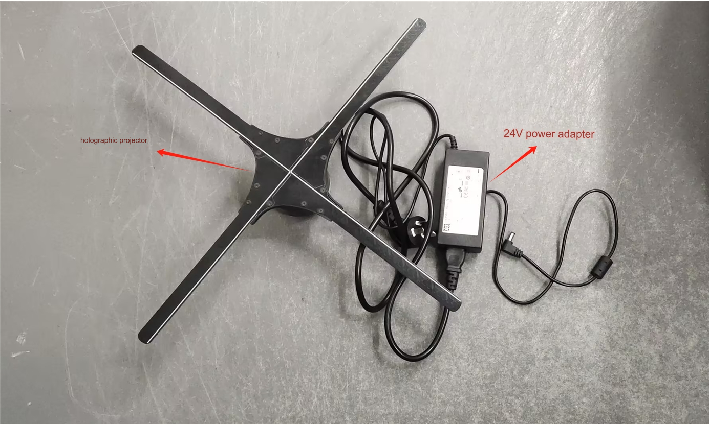

## 1.3 末端连接件
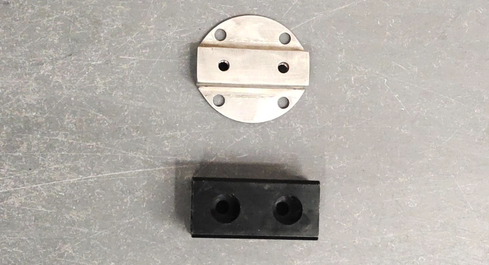

## 2 套件搭建
### 2.1 机器人姿态调整
先用VNC进入机器人系统，再先利用RoboFlow软件将机器人各关节回零点。更多机器人操作可到官方帮助文档查看机器人使用帮助文档

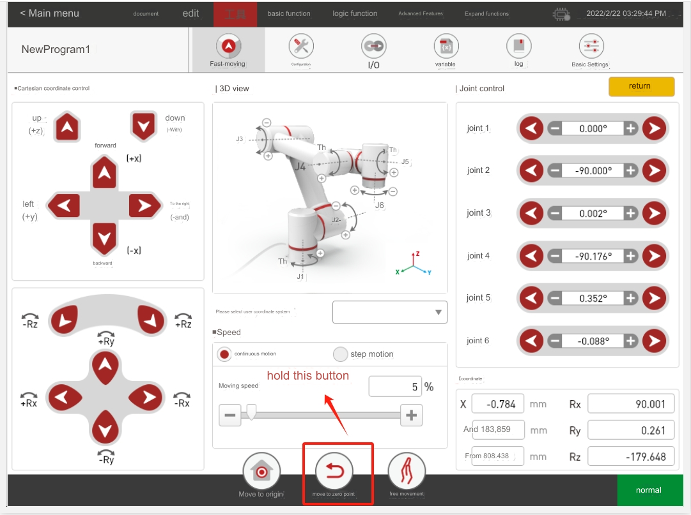

### 2.2 末端连接件安装
先用M6内六角扳手将4颗螺丝固定在机械臂末端法兰上
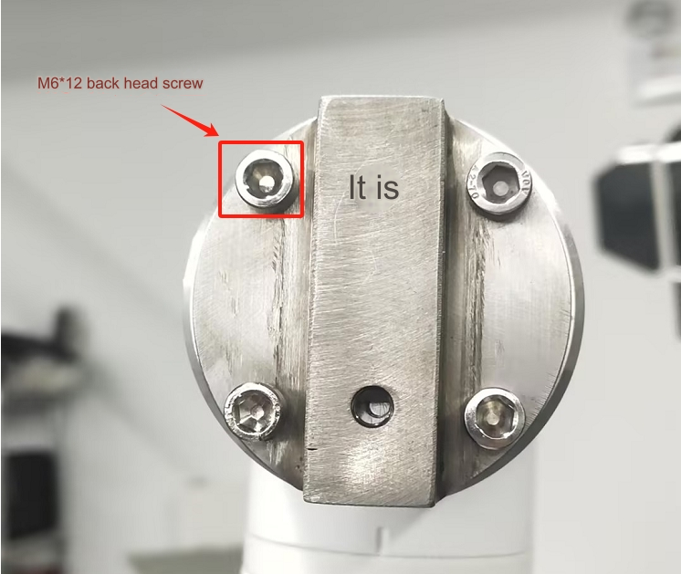
用M6内六角扳手将2颗螺丝固定金属件上
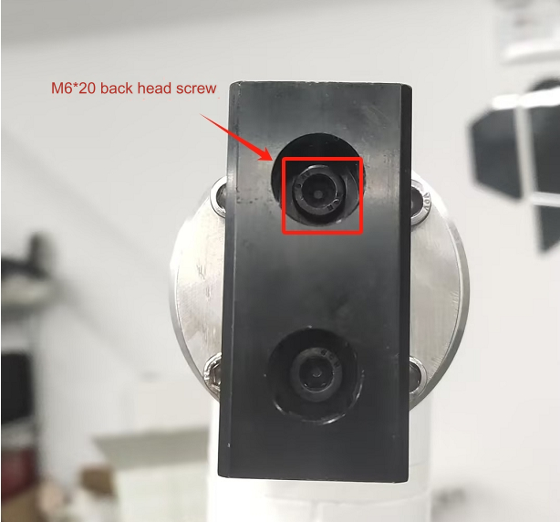

### 2.3 全息投影仪与连接件安装
用M5内六角扳手将全息投影仪与连接件拼接起来
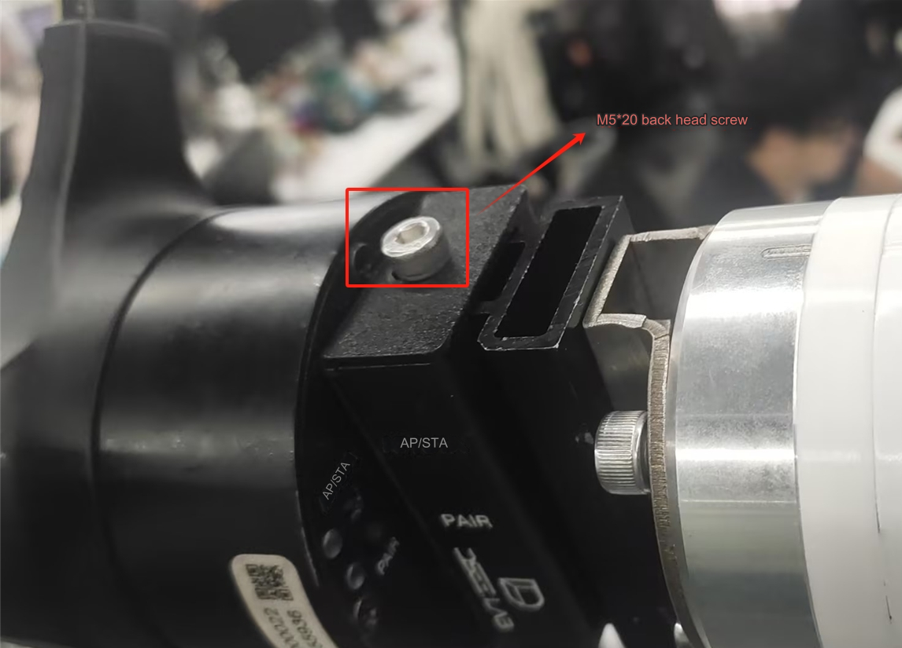

## 3 全息投影使用
### 3.1 WiFi连接
给全息投影插上24V电源适配器，利用电脑搜寻投影的wifi,wifi的密码贴在投影傍边。然后使用全息投影的软件进行连接。
第一步：給全息投影仪上电
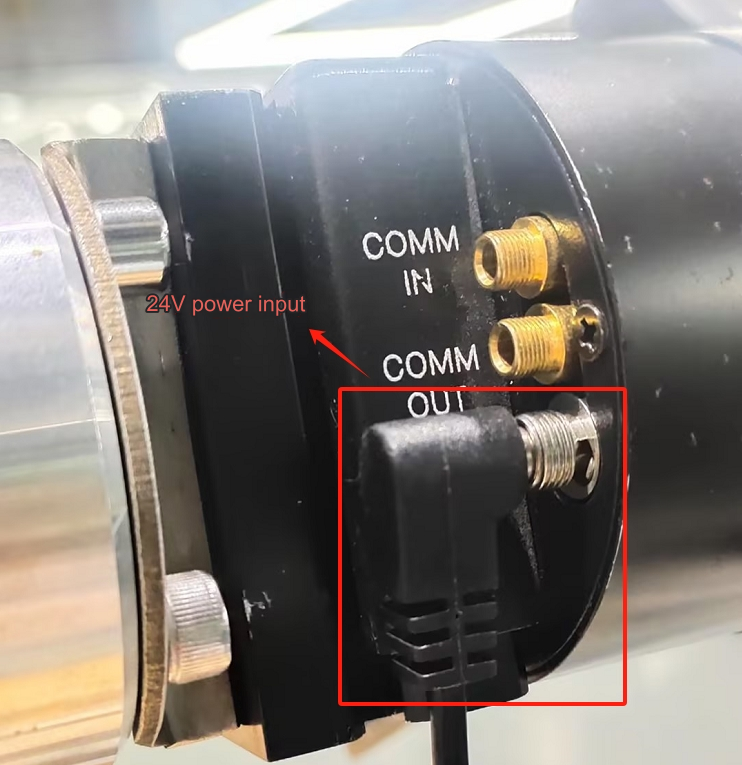
第二步：找到设备WIFI
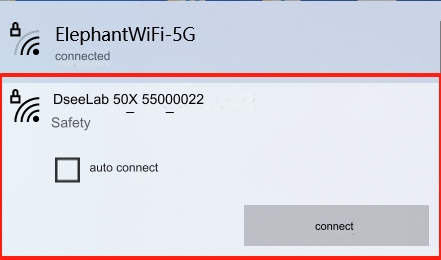
第三步：输入设备WIFI密码
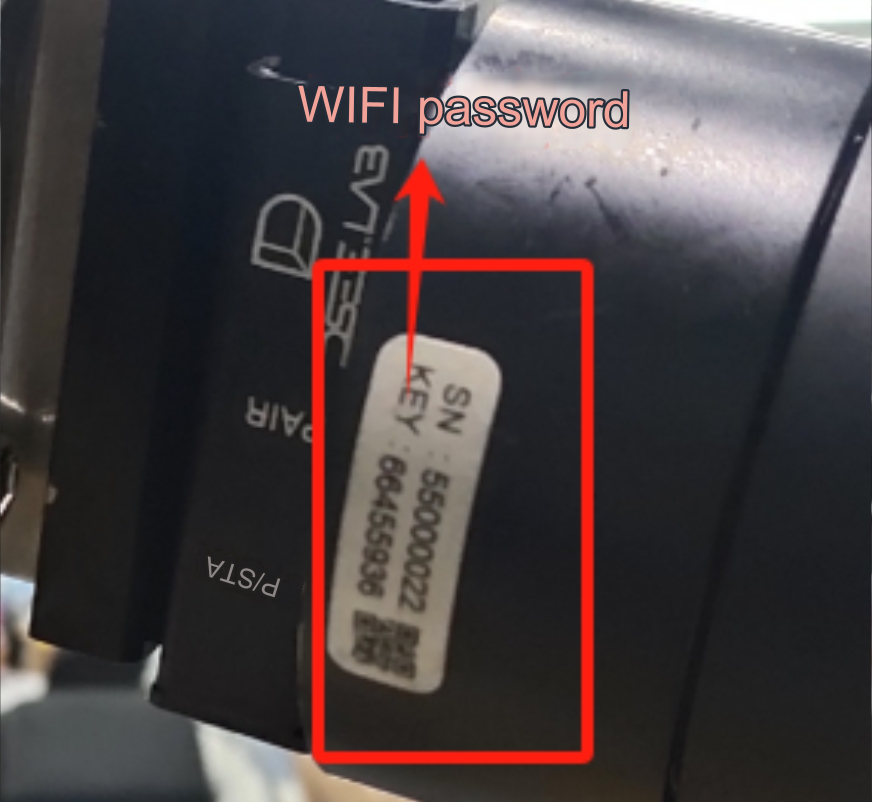

### 3.2影片上传
第一步：打开全息投影仪软件
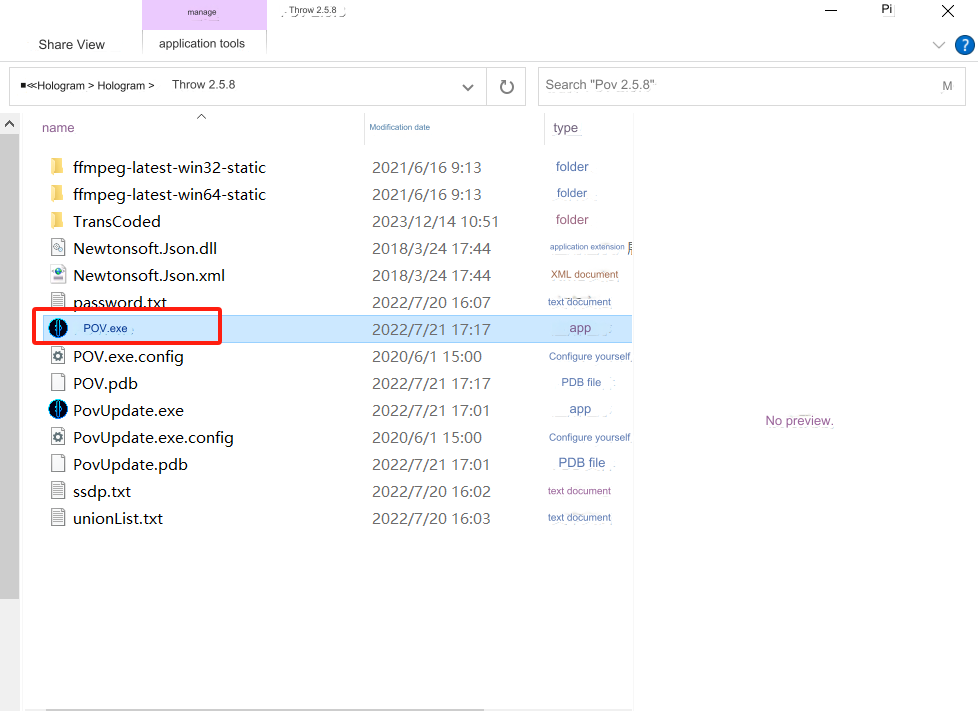
第二步：连接设备
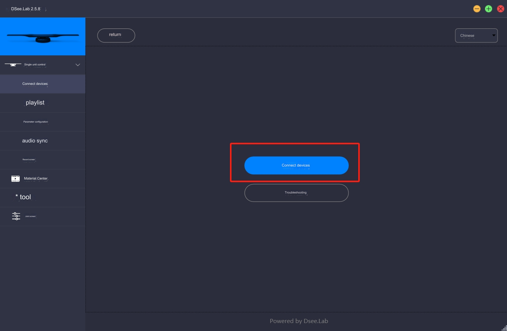
第三步：默认选择设备为一般模式
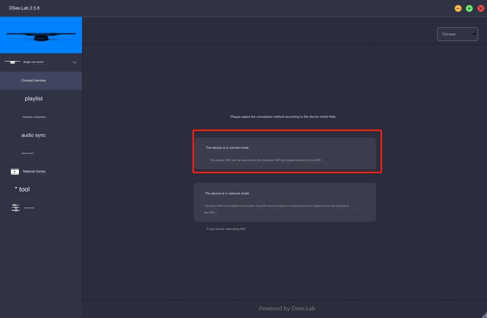

第四步：添加影片
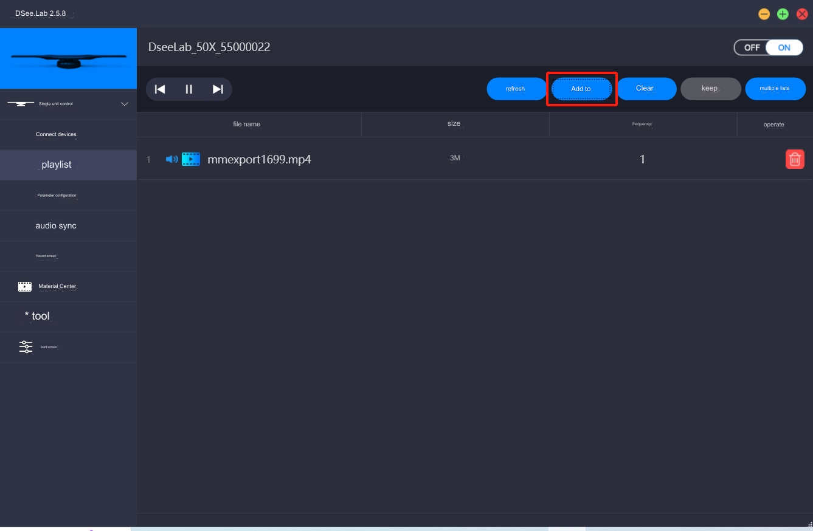
第五步：上传要放映的影片
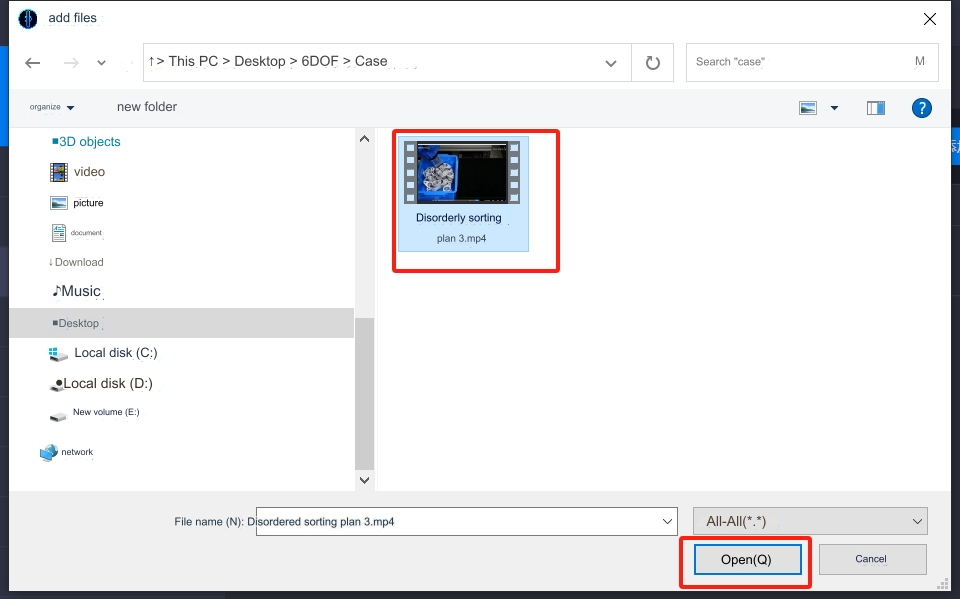

### 3.3 影片放映
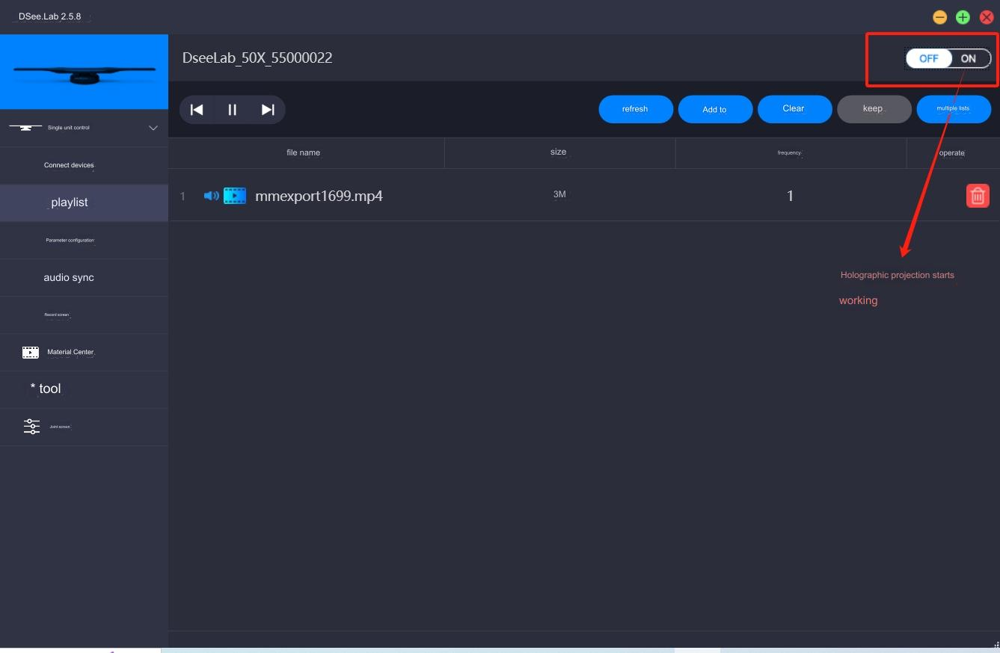

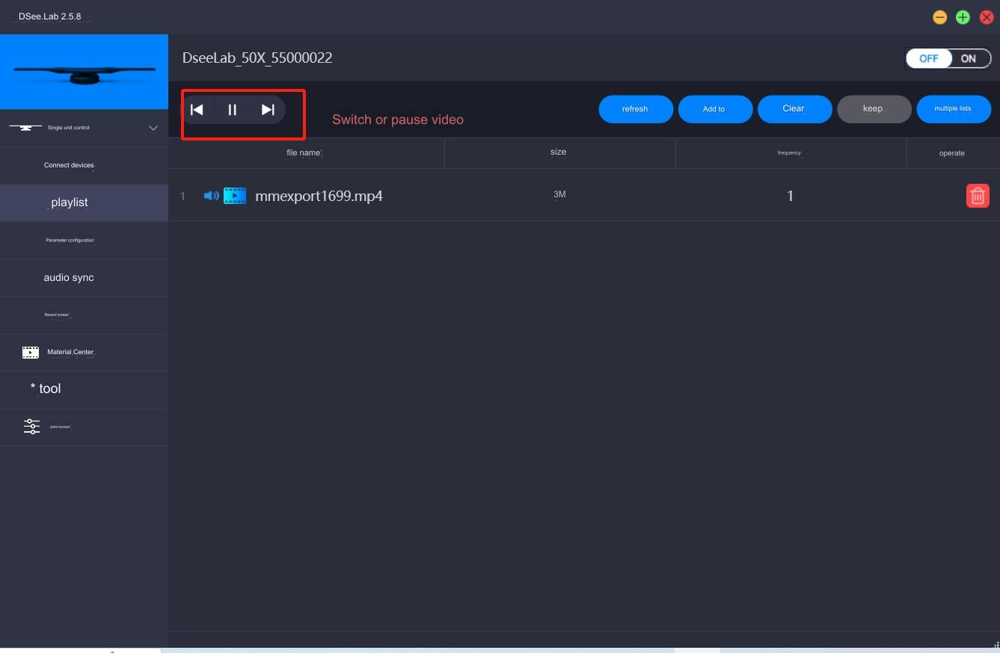

