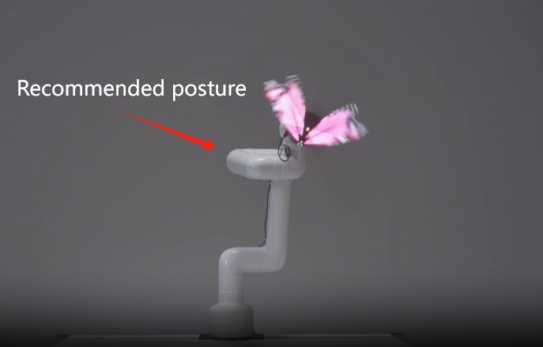

#holographic projection kit

## 1 Kit Hardware Introduction
### 1.1 MyCobot Pro630 Robotic Arm

## 1.2 Holographic Projector

## 1.3 End connector

## 2 Kit construction
### 2.1 Robot attitude adjustment
First use VNC to enter the robot system, and then use RoboFlow software to return each joint of the robot to the zero point. For more robot operations, please go to the official help document to view the robot usage help document.

### 2.2 Installation of end connectors
First use an M6 hex wrench to fix the 4 screws on the end flange of the robot arm.

Use an M6 hex wrench to fix the 2 screws on the metal part

### 2.3 Installation of holographic projector and connectors
Use an M5 hexagonal wrench to connect the holographic projector and connectors.

## 3 Use of holographic projection
### 3.1 WiFi connection
Plug in the 24V power adapter to the holographic projection, use the computer to search for the projection's wifi, and paste the wifi password on the projector. Then use holographic projection software to connect.
Step 1: Power on the holographic projector

Step 2: Find the device WIFI

Step 3: Enter the device WIFI password

### 3.2 Video upload
Step one: Open the holographic projector software

Step 2: Connect the device

Step 3: Select the device as normal mode by default

Step 4: Add videos

Step 5: Upload the video to be shown

### 3.3 Video screening

## 4 Notes
&emsp;&emsp;Users can set the robot point by themselves, and **the end posture of the robot arm is uniformly adjusted to the recommended posture in the picture below**. Let the robot arm move while playing the video. **When the holographic projection is running, it will rotate at high speed. Do not change the attitude of the end of the robotic arm at will to avoid collision between the robotic arm body and the projector**. It is recommended that when holographic projection is working, no one should stand within 2 meters around the robot and a safety fence should be arranged.

---

[← Previous page](../draw/draw.md) | [Next section →](../../8-FilesDownload/8-FilesDownload.md)