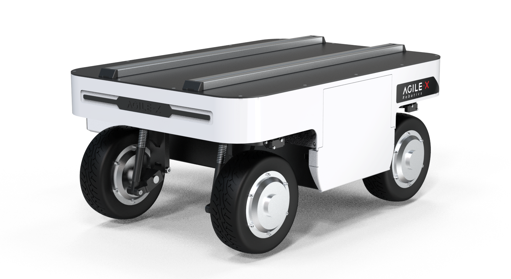
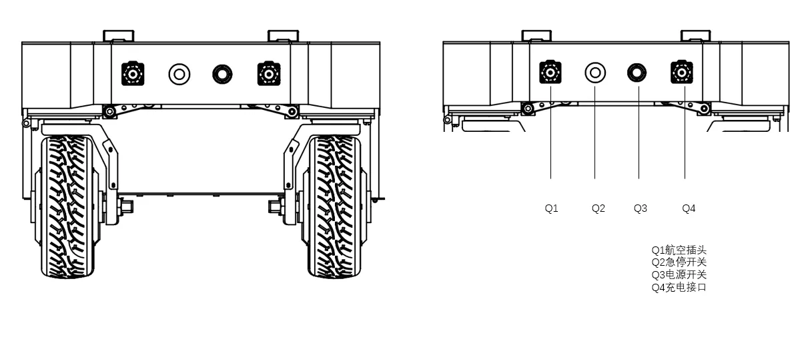
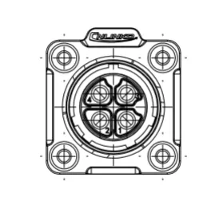
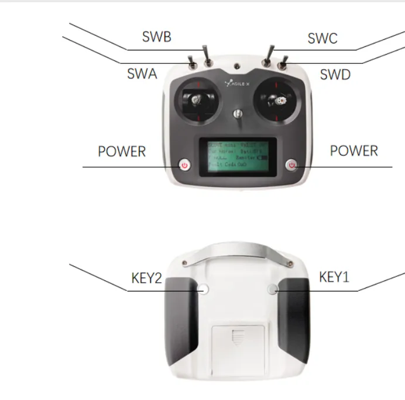
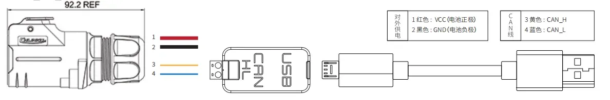
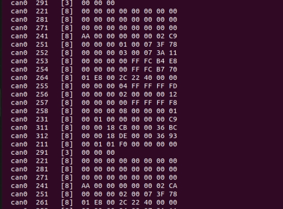

# Composite robot case

Ranger Mini V3.0:



## Equipment environment

Ranger mini V3.0, myCobot Pro 630, Jetson Orin nano development board, Realsense D435i camera, 2D N10P radar

## Ranger mini 3.0 electrical interface description



The rear of the RANGER MINI 3.0 chassis is equipped with an aviation expansion interface, which is equipped with a power supply and a CAN communication interface. It is convenient for users to provide power to the expansion device (load current cannot exceed 15A, voltage range 46~50V), as well as communication. The specific pin definition is shown in the figure below. It should be noted that the extended power supply here is controlled internally. When the battery voltage is lower than the safe voltage, the power supply will be cut off actively. Therefore, users need to pay attention. Before reaching the critical voltage, the RANGER MINI 3.0 chassis platform will notify through the flashing headlights. Users should pay attention to charging during use.



| **Pin number** | **Pin type** | **Function and definition** | **Remark** |
| :----------- | :--------- |:----------- | :--------- |
|1 |Power |VCC |Positive power supply, voltage range 46~50V, load current cannot exceed 15A|
|2 |Power |GND |Negative power supply|
|3 |CAN |CAN_H |CAN bus high|
|4 |CAN |CAN_L |CAN bus low|

## Remote control function description of the car

You can easily control the RANGER MINI with the remote control V3.0 Universal Robot Chassis Movement, its definition and functions are as follows:



### Button Function Definition

SWB is the control mode selection lever, which is turned to the top for command control mode, and to the middle or bottom for remote control mode; SWA is the light control switch, which is turned to the bottom to turn off the light (SWB needs to enter the remote control mode first); SWC is turned to the bottom for parking mode, at which time the four-wheel four-steering is locked in an X shape;

**SWD is the chassis motion mode setting switch**: SWD is turned to the top for ① front and rear Ackerman and ② spin mode ① The left joystick controls the speed, and the right joystick controls the angle; ② The left joystick does not move, and the right joystick controls the left and right directions of the spin;

**SWD is turned to the bottom for the oblique shift mode:** The left joystick controls the speed, and the right joystick controls the angle (the maximum angle of 90° is the lateral movement);

**Voltage/current drive mode switching:**
You need to first turn SWC to the bottom to enter the parking state, then turn SWB to the bottom, and then turn SWC to the top to exit the parking state to complete the switch

**Zero point calibration:**
First, turn the SWA lever to the bottom; SWB to the top; SWD to the bottom;
The four positions of the left joystick represent the steering motors corresponding to the four positions (for example: the upper right refers to the upper right corner steering motor, and the upper left refers to the upper left corner steering motor). The right joystick adjusts the angle in the left and right directions, and the left roller can adjust the SWC in two directions to adjust the sensitivity: DOWN→coarse adjustment MID→middle gear UP→fine adjustment, Key1 sets the current position as the zero point.

**Press KEY1 in any case = force clear all chassis errors. Note! ! It can only be used in special circumstances to ensure safety**

**POWER** is the power button, press and hold at the same time to turn on.

### Basic operation flow of remote control

Before starting, you need to **make sure that the wheels and chassis of RANGERMINI are parallel and facing forward**. After starting the RANGERMINI 3.0 mobile robot chassis normally (there is a power switch button at the tail, press it to turn on the power to start the car), start the remote control, switch SWB to remote control mode, and then you can control the movement of the RANGERMINI platform through the remote control.

**Note: When using the remote control joystick for operation, you need to push the joystick slowly and gently to avoid too fast speed. When there is a load on the top of the car, it is easy to cause unstable center of gravity when the speed is too fast, affecting the stability of motion control.**

## Car CAN bus connection

- Lead out the CAN line of the top aviation plug or the tail plug, and connect CAN_H and CAN_L in the CAN line to the CAN_TO_USB adapter respectively;

- Turn on the mobile robot chassis knob switch and check whether the emergency stop switches on both sides are released;

- Connect CAN_TO_USB to the USB port of the laptop. The connection diagram is shown in the figure.



## Install dependent packages

```bash
sudo apt-get update
sudo apt-get install build-essential git cmake libasio-dev libpcap-dev libboost-all-dev
sudo apt install ros-noetic-joint-state-publisher-gui -y
sudo apt install ros-noetic-ros-controllers -y
sudo apt install ros-noetic-gmapping -y
sudo apt install ros-noetic-map-server -y
sudo apt install ros-noetic-navigation -y
```

## Download the program code

```bash
cd ~/catkin_ws/src
git clone -b ranger_mini3.0 https://github.com/elephantrobotics/mc_embodied_kit_ros.git
cd ..
catkin_make
soure devel/setup.bash

```

## Radar serial port mapping

```bash
cd ~/catkin_ws/src/mc_embodied_kit_ros
sudo chmod +x wheeltec_udev.sh
sudo ./wheeltec_udev.sh
```

After the execution is successful, replug the device and enter the following command to verify:

```bash
ls -l /dev/wheeltec_lidar
```

If it is prompted that there is no device name, check whether there is a corresponding rule file (`wheeltec_lidar*.rules`) in the `/etc/udev/rules.d/` directory

## Test CAN communication

- To ensure that the CAN bus is enabled, you need to run this command every time you turn on the power and restart the system:

```bash
cd ~/catkin_ws && source devel/setup.bash
rosrun ranger_bringup setup_can2usb.bash
```

- If the can-to-usb has been connected to the robot, the robot has been powered on, and the CAN bus has been enabled, use the following command to monitor the data of the TRACER chassis:

```bash
candump can0
```

If the chassis data is normal, the terminal will always output the following data:



## Radar Mapping Navigation

### 1 CAN Bus Enable

To ensure that the CAN bus is enabled, you need to run this command every time you turn on the power and restart the system:

```bash
cd ~/catkin_ws && source devel/setup.bash
rosrun ranger_bringup setup_can2usb.bash
```

### 2 Start the car's underlying communication

Start the car's underlying node and radar communication, open a terminal, and run the following command:

```bash
cd ~/catkin_ws && source devel/setup.bash
roslaunch ranger_odometry ranger_active.launch
```

**Note:** Before starting the chassis node, make sure the CAN bus is enabled. When the system is restarted or the CAN bus is replugged, the enable command needs to be executed: `rosrun ranger_bringup setup_can2usb.bash`

### 3 Run the mapping program

Open a terminal and run the following command:

```bash
cd ~/catkin_ws && source devel/setup.bash
roslaunch ranger_navigation mapping.launch
```

### 3 Start mapping

Now, the chassis car can move under the remote control of the handle. At the same time, you can observe in the Rviz space that as the car moves, our map is gradually built.

Note: To get better map drawing effect, it is recommended to push the joystick slowly and drive at a low speed when operating the handle remote control, because lower speed tends to produce better map drawing effect.

### 4 Save the built map

Open another new terminal console and enter the following command in the command line to save the map scanned by ranger:

```bash
cd ~/catkin_ws/src/mc_embodied_kit_ros/ranger_navigation/map

rosrun map_server map_saver

```

After successful execution, two default map parameter files, map.pgm and map.yaml, will be generated in the current path (`~/catkin_ws/src/mc_embodied_kit_ros/ranger_navigation/map`).

### 5 Map navigation + PRO630 movement

>> Note: Before starting navigation, it is recommended to place the initial position of the car at the starting position of the car when drawing the map.

Before this, we have successfully created a spatial map and obtained a set of map files, namely map.pgm and map.yaml in the `~/catkin_ws/src/mc_embodied_kit_ros/ranger_navigation/map` directory.

#### 5.1 Start the car's underlying communication

>> Note: If it has already been started, please ignore this operation

Start the car's underlying node and radar communication, open a terminal, and run the following command:

```bash
cd ~/catkin_ws && source devel/setup.bash
roslaunch ranger_odometry ranger_active.launch
```

#### 5.2 Start the navigation program

Open a terminal and enter the following command to run:

```bash
cd ~/catkin_ws && source devel/setup.bash
roslaunch ranger_navigation navigation_active.launch
```

After the program is successfully started, you can perform navigation operations in the rviz interface. The car moves from point A to point B, and myCobot Pro 630 performs related actions. The effect demo is as follows:

<video id="my-video" class="video-js" controls preload="auto" width="100%"
poster="" data-setup='{"aspectRatio":"16:9"}'>
  <source src="../../resources/7-ExamplesRobotsUsing/RobotCase/ranger_miniV3.0_630.mp4" type='video/mp4' >
</video>

## Realsense 3D camera usage

### Dependent library installation

1. Register the server's public key:

    ```bash
    sudo apt-key adv --keyserver keyserver.ubuntu.com --recv-key F6E65AC044F831AC80A06380C8B3A55A6F3EFCDE || sudo apt-key adv --keyserver hkp://keyserver.ubuntu.com:80 --recv-key F6E65AC044F831AC80A06380C8B3A55A6F3EFCDE
    ```

2. Add the server to the repository list:

    ```bash
    sudo add-apt-repository "deb https://librealsense.intel.com/Debian/apt-repo $(lsb_release -cs) main" -u
    ```

3. Install the SDK:

    ```bash
    sudo apt-get install librealsense2-utils librealsense2-dev
    ```

### Verify usage

Open the console terminal and enter the following command:

```bash
realsense-viewer
```

For more details, please refer to:[Jetson Installation Guide](https://github.com/IntelRealSense/librealsense/blob/master/doc/installation_jetson.md)