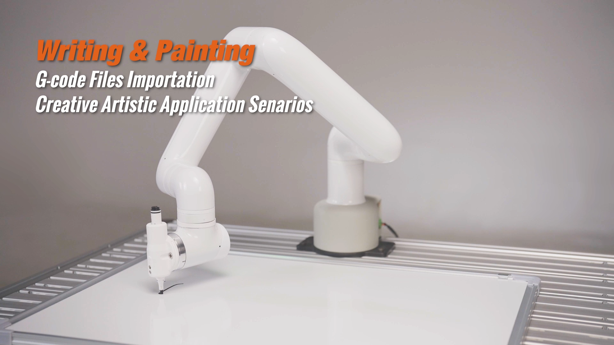
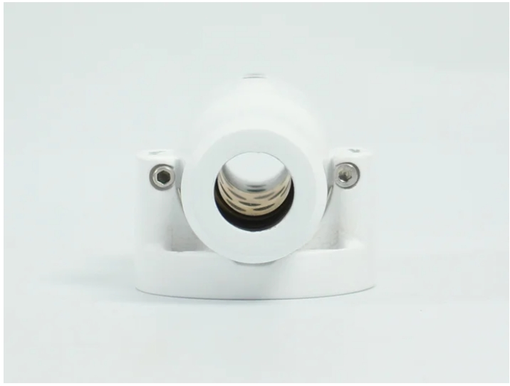
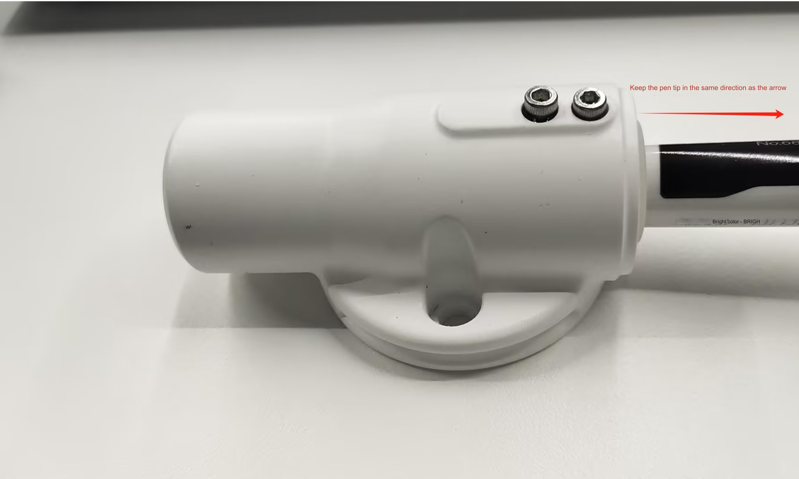

# 写字画画套件

## 1 套件硬件介绍
### 1.1 MyCobot Pro630机械臂

## 1.2 myCobot Pro 笔夹持器

## 2 笔夹持器安装
用内六角将螺丝拧松，便于将马克笔插入进去

将马克笔从靠近螺丝的一侧插入,用内六角将螺丝锁紧

先用VNC进入机器人系统，再先利用RoboFlow软件将机器人各关节回零点。

各个关机回到零点的状态

用内六角将笔夹持器固定在机械臂末端法兰

用roboFlow的quickmove操作各个关节，将机械臂的姿态调整到如下图所示，可根据自己的需要对整体姿态做调整

通过坐标控制，控制机械臂将笔尖轻压画板

拍照记录当前机械臂关节角度值与笛卡尔空间坐标值

