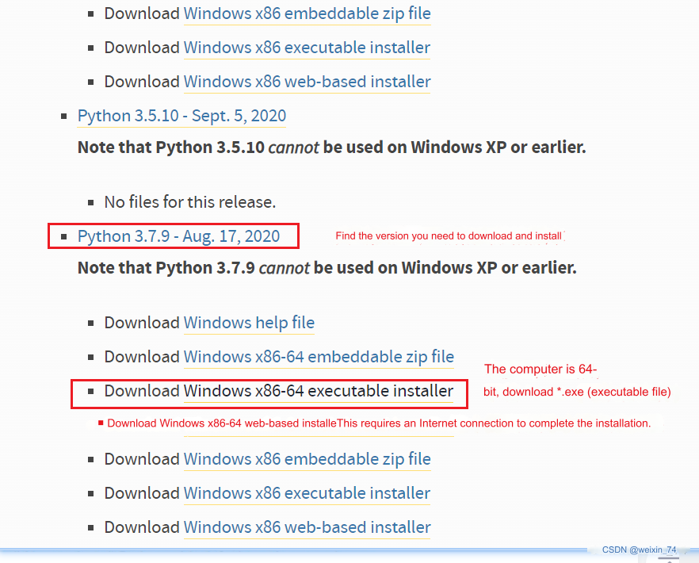

#Writing and drawing kit

## 1 Kit Hardware Introduction
### 1.1 MyCobot Pro630 Robotic Arm

## 1.2 myCobot Pro Pen Holder

## 2 Pen holder installation
Use the hexagon socket to loosen the screw to facilitate inserting the marker pen into it.

Insert the marker from the side close to the screw and tighten the screw with the hexagon.

First use VNC to enter the robot system, and then use RoboFlow software to return each joint of the robot to the zero point.

Each shutdown returns to the zero point state.

Use the inner hexagon to fix the pen holder to the end flange of the robot arm.

Use roboFlow's quickmove to operate each joint and adjust the posture of the robotic arm as shown in the figure below. You can adjust the overall posture according to your own needs.

Through coordinate control, control the robotic arm to lightly press the pen tip on the drawing board

Take a photo to record the current robot arm joint angle value and Cartesian space coordinate value

## 3 Software environment construction

## 3.1 Python installation

[Download address](https://www.python.org/downloads/windows/)

Select the version you want to install. It is recommended to install version 3.7 or above.

After double-clicking the installation package

Keep the default configuration and click Next

If you select a custom software installation location, click Install
(It is recommended that the installation file path be an English path, because some software installations cannot be opened when encountering Chinese)

## 3.2 Inkscape installation
Double-click the Inkscape installation package in the folder and click Next in the pop-up window.

Click "I accept"

Check "Create Inkscape Desktop Icon" and click "Next"

It can be installed by default, and users can also change the installation path.

Click "Next"

Click "Install" and wait for the installation to complete

Open the folder "ElephantRobotics_Pro600 trajectory plug-in v1.2", select all the contents in the folder, right-click and select "Copy", as shown in the figure

Right-click the Inkscape application generated on the desktop, click "Properties", and click "Open file location (F)" under the shortcut page
Click Inkscape under the file path to return to the previous layer, as shown in the figure below

Enter the folders "share", "inksape" and "extensions" in sequence. The path is as shown in the figure below.

Right-click on an empty space in the folder and select "Paste", as shown in the figure

Check "Perform this operation for all current projects (A)" and click "Continue". After the paste is completed, you can close the windows.

## 4 Trajectory file generation
Double-click the desktop Inksape application, click "Create New Document" in the lower right corner of the pop-up window, click "File" in the title bar, and select "Open"

In the pop-up window, select the path where the material is placed, select the required material, and click "Open" (Note: the material format is a .png file)

In the small window that pops up, check "Don't ask again", click "OK", click the cursor button on the left toolbar, and then click the line in the picture to select the picture. After the picture is selected, the edge becomes a dotted line and a pull appears as shown in the figure. Stretch arrow

Select the stretch arrow in the small right corner of the picture, and control the length and width of the picture to be within 270 and 400 as shown in the figure below (Note: the length is X and the width is Y)

As shown in the figure, click the rotate button on the upper toolbar to rotate the image 180 degrees.

Select "Path" in the title bar, click "Object to Path" and "Copy Bitmap Outline"

In the small window, click the drop-down button on the right side of the brightness truncation to select other path tracing line modes (Note: "Brightness truncation" generates a thicker path that requires two strokes. "Centerline tracing" expresses thicker lines. The effect is more subtle)

Select the picture and move the picture to another blank area. It can be seen that there are two materials

Select the material in its original position and press the [Delete] key on the keyboard to leave the moved material as shown in the figure.

Then move the remaining material to its original position, paying attention to aligning the upper left corner. Select "File" in the title bar as shown in the figure and click "Save As".

In the pop-up file saving window, select the file saving path, then select the saving type as .ngc, and choose whether to modify the file name according to your needs, and click "Save"

In the pop-up window, modify the parameters item by item as shown below.

Select the HomePosition page and fill in the initially recorded robot arm joint coordinates and Cartesian coordinate values into the corresponding positions; click "OK" after the modification is completed.

Wait for the window as shown below to pop up, and click the "OK" button

In the file saving path you just selected, you can see that the .ngc file has been generated.

## 5 Trajectory recurrence
Copy the generated NGC file from the computer to a USB flash drive, insert the USB flash drive into the USB interface of the robotic arm base, and copy the NGC file to the path as shown below

With the robot started, in the RoboFlow programming interface, click on the basic function of the title bar - trajectory teaching.

At this time, the new addition (trajectory teaching) is visible in the program tree. Click "Open" on the screen.

Select the .ngc file that needs to be loaded and click "OK". Click the "Play" button as shown in the figure, and the robot arm will start to execute the drawing trajectory and automatically stop after the trajectory is completed. If you need to stop midway, just click the "Play" button again.

---

[← Previous page](../2.5D/2.5D.md) | [Next section →](../LED/LED.md)