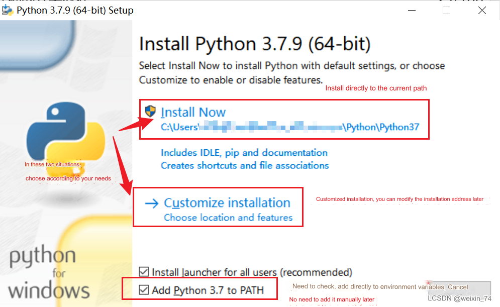

# 写字画画套件

## 1 套件硬件介绍
### 1.1 MyCobot Pro630机械臂

## 1.2 myCobot Pro 笔夹持器

## 2 笔夹持器安装
用内六角将螺丝拧松，便于将马克笔插入进去

将马克笔从靠近螺丝的一侧插入,用内六角将螺丝锁紧

先用VNC进入机器人系统，再先利用RoboFlow软件将机器人各关节回零点。

各个关机回到零点的状态

用内六角将笔夹持器固定在机械臂末端法兰

用roboFlow的quickmove操作各个关节，将机械臂的姿态调整到如下图所示，可根据自己的需要对整体姿态做调整

通过坐标控制，控制机械臂将笔尖轻压画板

拍照记录当前机械臂关节角度值与笛卡尔空间坐标值

## 3 软件环境搭建

## 3.1 Python安装

[下载地址](https://www.python.org/downloads/windows/)

选择你要安装的版本,推荐安装3.7以上版本

双击安装包后

保持默认配置，直接点击Next

若选择自定义软件安装位置后，点击Install
（建议安装的文件路径是全英路径，因为有些软件安装遇到中文会打不开）

## 3.2 Inkscape安装
双击文件夹中的Inkscape安装包，在弹出的窗口点击下一步

点击“我接受”

勾选“Create Inkscape Desktop Icon”依次点击“下一步”

默认安装即可，用户也可更改安装路径

点击“下一步”

点击“安装”，等待安装完成即可

打开文件夹“ElephantRobotics_Pro600轨迹插件v1.2”，全选文件夹中内容，并右键点击，选择“复制”，如图所示

右键点击桌面生成的Inkscape应用程序，点击“属性”,点击快捷方式页面下的“打开文件所在的位置（F）”
点击文件路径下的Inkscape，返回上一层，如下图所示

依次进入文件夹“share”“inksape”“extensions”，此时路径如下图所示。

在文件夹中空白位置点击右键，选择“粘贴”，如图所示

勾选“为所有当前项目执行此操作（A）”，点击“继续”，粘贴完成后可将窗口都关掉。

## 4 轨迹文件生成
双击桌面Inksape应用程序，点击弹窗右下角“创建新文档”，点击标题栏的“文件”，选择“打开”

在弹出的窗口中选择素材放置的路径，并选择需要的素材，并点击“打开”（注：素材格式为.png文件）

在弹出的小窗口中，勾选“不再询问”，点击“OK”，点击左侧工具栏的光标按钮，再点击图片中线条选中图片，图片选中后如图可见边缘变为虚线且出现拉伸箭头

选择图片右小角的拉伸箭头，并将图片长宽值如下图所示控制在270与400以内（注：长为X，宽为Y）

如图点击上方工具栏的旋转按钮，将图片旋转180度。

选择标题栏中的“路径”，依次点击“对象转路径”和“临摹位图轮廓”

在小窗口中，点击亮度截断右侧的下拉按钮，可选择其他的路劲线条模式（说明：“亮度截断”生成的路径较粗需要运行两笔，表现效果线条较为粗“Centerline tracing”则表现效果较为细）

选中图片，并将图片移动到其他空白区域，可见存在两个素材

选中原位置素材，并按下键盘【Delete】键，如图所示留下移开的素材。

再将留下的素材移动到原位置上，注意左上角对齐。如图选择标题栏的“文件”，点击“另存为”。

在弹出的文件保存窗口中，选择文件保存路径，再选择保存类型为.ngc，并根据需求选择是否修改文件名，点击“保存”

在弹出的窗口中，按下图参数逐项进行修改

选择HomePosition页面，并将最初记录下的机械臂关节坐标与笛卡尔坐标值依次填写到对应位置中；修改完成后点击“OK”。

等待弹出如下图窗口，并点击“确定”按钮

在刚刚所选择的文件保存路径下，可以看到已经生成了.ngc文件

## 5 轨迹复现
将生成NGC文件从电脑拷贝到U盘，将U盘插入机械臂底座的USB接口,将NGC文件拷贝到如下图的路径

