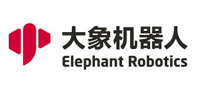

# 关于我们

&emsp;&emsp;本章主要提供有关公司简介和发展历史的信息，为用户提供团队和机器人的额外背景。“联系我们”部分提供了详细的联系信息，包括电子邮件格式、描述问题的说明和复制步骤的模板。这使用户能够与团队进行有效沟通并解决问题。总的来说，本章的目标是在展示公司和团队信息的同时，与用户建立高效的沟通渠道。

---
[← 上一页](../8-FilesDownload/8-FilesDownload.md) | [下一页 →](./9.1-company.md) 