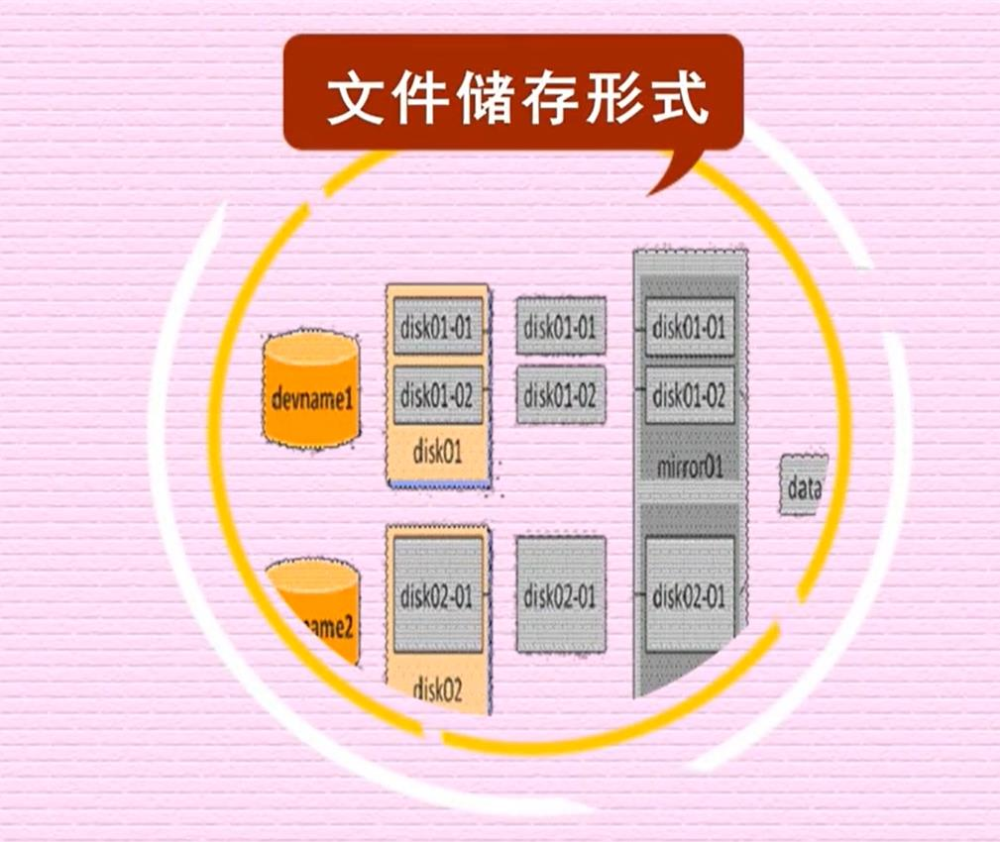

# 什么是镜像？

镜像（Mirroring）是一种文件存储形式。一个磁盘上的数据在另一个磁盘上存在一个完全相同的副本即为镜像。常见的镜像文件格式有ISO、BIN、IMG、TAO、DAO、CIF、FCD。所谓镜像文件其实和ZIP压缩包类似，它将特定的一系列文件按照一定的格式制作成单一的文件，以方便用户下载和使用，例如一个测试版的操作系统、游戏等。镜像文件不仅具有ZIP压缩包的“合成”功能，它最重要的特点是可以被特定的软件识别并可直接刻录到光盘上。其实通常意义上的镜像文件可以再扩展一下，在镜像文件中可以包含更多的信息。比如说系统文件、引导文件、分区表)信息等，这样镜像文件就可以包含一个分区甚至是一块硬盘的所有信息。使用这类镜像文件的经典软件就是Ghost，它同样具备刻录功能，不过它的刻录仅仅是将镜像文件本身保存在光盘上，而通常意义上的刻录软件都可以直接将支持的镜像文件所包含的内容刻录到光盘上。