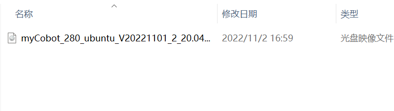
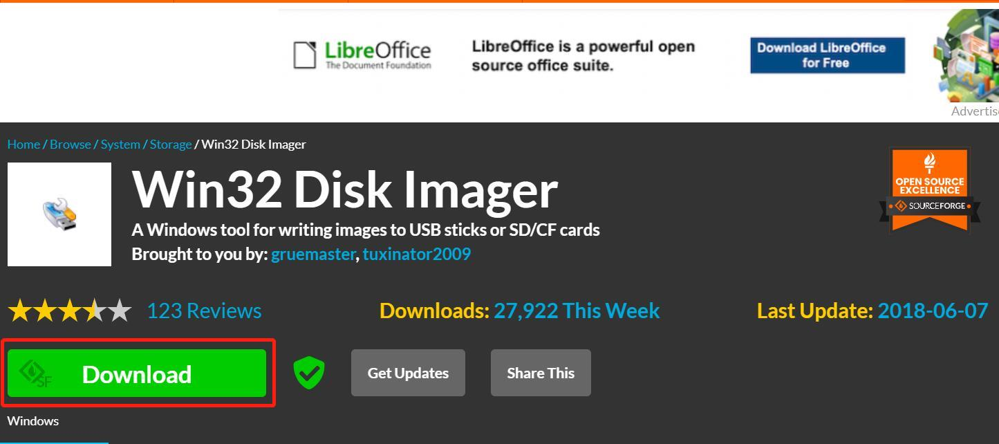
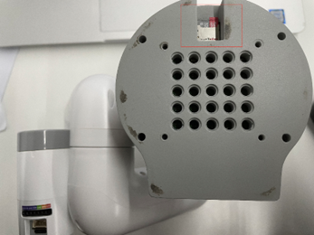
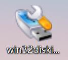
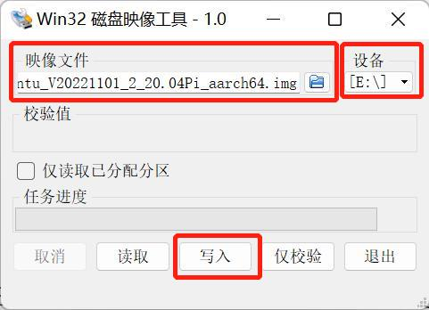
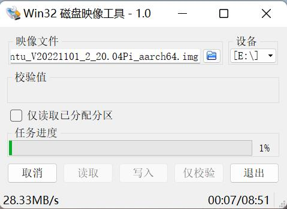
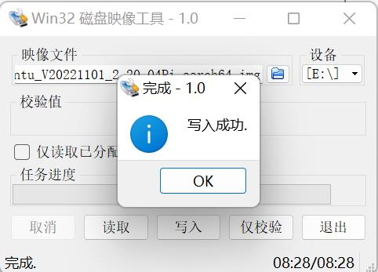

# Mirror Burning

This chapter describes the steps to download and burn mirrors, if you have already downloaded the required mirrors, you can directly view the burning steps

## 1.1 Download Links

| IMPORTANT NOTICE
|-------------|
| Please contact after-sales service to get the latest resources if you need to burn the image, after-sales service email: support@elephantrobotics.com |

## 1.2 Burning Steps

**Step 1:** Unzip the file after downloading the image, you can see a CD image file.

**Step 2:** Download the Win32DiskImager software.

download address：[Win32DiskImager](https://sourceforge.net/projects/win32diskimager/)

**Step 3:** Remove the SD card from the bottom of the robot arm and insert the SD card into the computer using a card reader.

**Step 4:** Open the Win32DiskImager burning software.

**Step 5:** Select the E-disk and the CD-ROM image file, and then click “Write” to start writing.

**Step 6:** You will be prompted when the write is successful.

