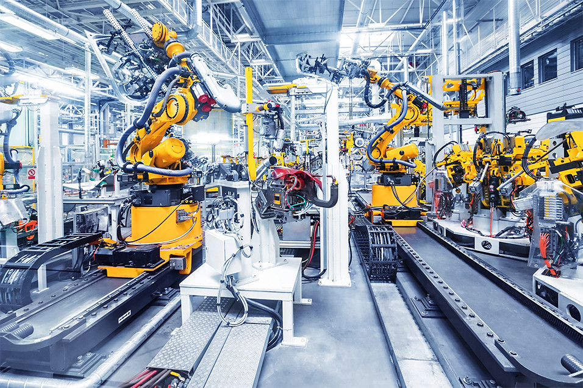

# 介绍

## my系列 - 《从入门到精通》

### 为什么设计myCobot

> 人人都可以学习玩耍的**入门级协作机器人**

myCobot的设计初衷是为了让对**六自由度串联机械臂**感兴趣的朋友，可以**从0到1**的了解、学习和操作机械臂，创造前所未有的机械臂使用体验与教学价值。

---

### 你能学到什么

机器人学的基础是刚体运动学、动力学。但同时融合了硬件、软件、算法和控制的一门交叉学科。通过小象协作机械臂，大家可以学习到：

+ **硬件**
  + **基于ESP32的嵌入式单片机** -- 什么是单片机，单片机基本原理，esp32单片机。
  + **电机与舵机**	-- 什么是电机，电机的与舵机的关系，舵机的基本原理。
  + **M5Stack-basic/ Atom**
+ **软件**
  + **Arduino开发环境** 
  + **C++**
  + **Python**
  + **ROS平台，MoveIt仿真**
  + **通信数据的设计**
  + **虚拟机与Linux（视觉系统）**
+ **算法**
  + **串联机械臂背景知识**
  + **坐标与坐标转换**
  + **DH参数与使用**
  + **刚体运动学kinematics**
  + **其他可能的机械臂算法（如动力学）**
+ **机器视觉（视觉套装）**
  + **颜色识别**
  + **图像识别**
  + **手眼标定**
  + **联动抓取**
+ **其他**
  + **机器人常用执行器：夹爪、吸泵**
  + **从手工到机器人**
  + **高级套装**

### 这本书的组成部分

> 查看左侧目录进行跳转

这本书包括了九大部分。他们分别是

+ **简介** 
  + **公司简介**  -- 介绍公司发展。
  + **my系列发展历程**  -- 您可以清晰的看到，my系列的产品发展历程。
  + **如何阅读**  -- 根据您的学习程度和知识背景，可以选择何时的阅读与使用路径。
  + **如何优雅提问**  -- 提高问题被快速解决的几率。
     

+ **设备选购指南**
  + **myCobot 280** -- 全球最轻最小的六轴协作机器人。
  + **myCobot 320** -- 面向科研的最小协作机器人。
  + **myCobot Pro 600** -- 小象协助机械臂商用版。
  + **myPalletizer 260** -- 全球首款全包裹式的四轴机械臂。
  + **myAGV** -- 最小复合移动机器人。
  + **配件** -- 丰富的产品配件。
  + **AI Kits** -- 通过机器视觉对机器人进行引导，并进行智能抓取。

+ **开发前的准备**
  + **mystudio** -- mystudio 环境搭建以及简单使用。
  + **通信与报文命令** -- 通信与报文命令使用时的环境搭建以及简单使用。
  + **Arduino**  -- Arduino 环境搭建以及简单使用。
  + **Python** -- Python 环境搭建以及简单使用。
  + **C++**  -- C++ 环境搭建以及简单使用。
  + **Ros** -- Ros 环境搭建以及简单使用。
  + **Roboflow**  -- Roboflow 环境搭建以及简单使用。
  + **Myblockly** -- Myblockly 环境搭建以及简单使用。

+ **简单上手** 
  + **拖动示教** -- 操作员可以直接拖着机器人各关节，运动到理想的姿态并记录下来。
  + **校准机械臂** -- 校准机械臂是对机械臂精准控制的前提，设置关节零位，初始化电机的电位值。
  + **通讯转发** -- basic底座和atom末端执行器进行数据通讯。
  + **检测信息** -- 检测信息中您将看到机械臂和basic的版本。

+ **进阶教程** 
  + **关节控制** -- 对机械臂六个关节进行角度控制。
  + **坐标控制** -- 使机械臂运动到指定坐标位置。
  + **IO控制** -- IO输入与输出。
  + **设备通讯** -- 利用指令对机械臂控制。
  + **微控制器** -- 通过烧录demo开关力矩和屏幕显示。
  + **LED灯** -- 设置LED颜色。
  + **ros** -- 适用于myAGV。

+ **API手册** 
  + **Arduion库** -- 只适用于微控制器类机器。

+ **末端执行器** 
  + **夹爪** -- 多种夹爪选择，实现不同功能。
  + **吸泵** -- 吸取物体，可搭配视觉。
  + **摄像头法兰** -- 机器视觉。

+ **高级套装** 
  + **人工智能套装** -- 通过机器视觉对机器人进行引导，并进行智能抓取。

+ **常见问题** 
  + **驱动库问题** -- 用户使用过程中常见的驱动库相关问题。
  + **软件问题** -- 用户使用过程中常见的软件相关问题。
  + **硬件问题** -- 用户使用过程中常见的硬件相关问题。