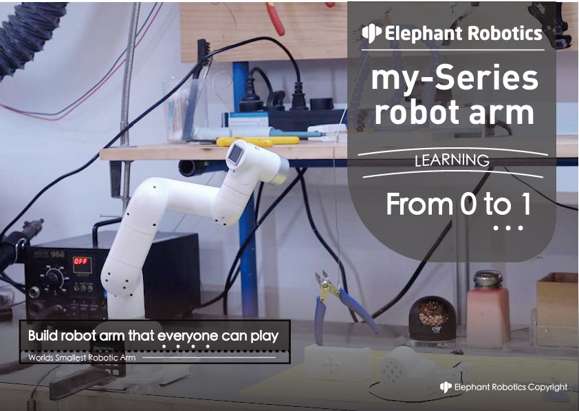

# myCobot: From 0 to 1

### 1.1 Why do we design myCobot
> **An entry-level collaborative robot arm** that everyone can learn and play

The original design of myCobot is to help friends who are interested in 6-axisseries robot to learn it from entry to master, creating unprecedented experience and teaching value.
---

### What you can learn
> Robotics is based on rigid body kinematics and dynamics, but also an interdisciplinary subject that combines hardware, software, algorithm and control.

With myCobot, you can learn that

+ **Hardware**
	+ **Embedded Microcontroller Based on ESP32**
	+ **Motor and Steering Gear**
	+ **M5Stack Basic/ Atom**
+ **Software**
	+ **Arduino开发环境** 
	+ **C++**
	+ **Python**
	+ **ROS，MoveIt**
	+ **Communication Data**
	+ **Virtual Machines & Linux (visual system)**
+ **Algorithm**
	+ **Series Manipulator**
	+ **Coordinate and Coordinate Transformation坐标与坐标转换**
	+ **DH Parameters**
	+ **Kinematics**
	+ **Manipulator Algorithm (e.g. dynamics)**
+ **Machine Vision (Vision Set)**
	+ **Color Recognition**
	+ **Image Recognition**
	+ **Hand-Eye Calibration**
	+ **See and Grab**
+ **Extended Applications**
	+ **End-effector: gripper,suction pump, etc.**
	+ **Robot Suit & Industry 4.0 Applications**

### Parts of Gitbook
> View the directory on the left to jump

There are four major parts of Gitbook :

+ **Introduction & Quick Start** 
	+ **Introduction**  -- introduce what myCobot is and its main features, etc.
	+ **How to Read**  -- help you read Gitbook efficiently according to your learning level and knowledge background
	+ **Use Cases**  -- you can know exactly what use cases you can accomplish with
	+ **Quick Start**  -- learn the unboxing of your myCobot, and its first boot and use
	 
+ **Preparation before Development**
	+ **Background Knowledge** -- learn about tools, industrial robots, algorithms, software, hardware,etc.
	+ **Hardware Learning** -- learn about embedded hardware, structural components, electronic components, etc.
	+ **Purpose of Use** -- identify the purpose you want to use it for, and complete the study related to your task
	 
+ **Development and Use**
	+ **Development Environment** -- learn to use Arduino, ROS, uiFlow, roboFlow, python and others development environment to develop myCobot
	+ **Accessories** -- learn to use myCobot with different accessories, such us bases, grippers, suction pumps and so on
	+ **Machine Vision**  -- learn to control myCobot under the guidance of machine vision
	+ **Robot Modification** -- learn how to modificate myCobot into a 4 or 5 axis manipulator
	 
+ **myCobot Suit** 
	+ **Intelligent Warehouse:** learn how to use myCobot to carry different objects
	+ **Artificial Intelligence:** learn how to control myCobot to grasp objects intelligently under the guidance of machine vision
	+ **Industry 4.0:** learn how to grasp and place objects intelligently by simulating production line

***

### Information Source
- **Official website:**
  [www.elephantrobotics.com](http://www.elephantrobotics.com)
- **Tutorial video:**
  [https://www.youtube.com/channel/UC68l2RaRF2Mp8fzpCTzNBfA](https://www.youtube.com/channel/UC68l2RaRF2Mp8fzpCTzNBfA)
- **Shop website:**
  [https://shop.elephantrobotics.com](https://shop.elephantrobotics.com/)
- [Download PDF](https://www.elephantrobotics.com/docs/pdf/myCobot-en.pdf)

***

### Contact Us

> **If you have any other questions, you can contact us as follows.**

> **We will answer you as soon as possible ( working day 9:30-18:30)**

- Twitter: myCobot Official\@CobotMy
- Facebook: [https://www.facebook.com/MyCobot-116558893805177](https://www.facebook.com/MyCobot-116558893805177)
- Mail: <support@elephantrobotics.com>
